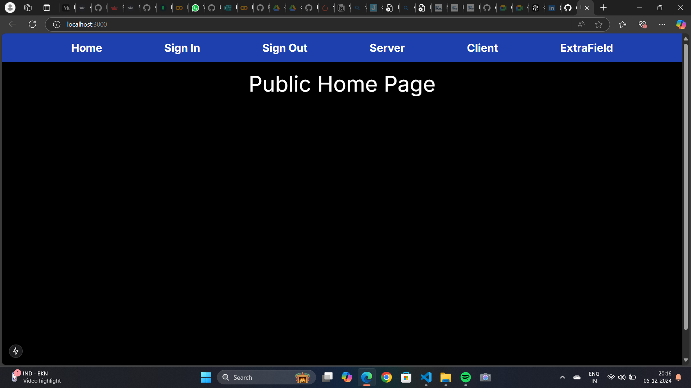

# VRV-Assignment-Role-based-Application-Control


## User Authorization & Protected Routes

### With Next.js App Router

Here's a concise **README** for your project on implementing **Role-Based Access Control (RBAC)** using **NextAuth.js** in a **Next.js application**:

---

# Role-Based Access Control with NextAuth.js in Next.js

## Overview

This project demonstrates how to implement **Role-Based Access Control (RBAC)** in a **Next.js** application using **NextAuth.js**. It provides a secure way to manage user authentication and authorization based on user roles (e.g., admin, user).

## Features

- **User Authentication**: Supports login via **GitHub** and **Credentials Provider**.
- **Role Assignment**: Users are assigned roles (admin or user), which are persisted across sessions.
- **Protected Routes**: Restrict access to pages based on user roles.
- **Session Management**: Uses **JWT tokens** and **session callbacks** to manage user sessions and roles.
- **Dark/Light Mode UI**: Automatically adjusts the UI based on the user’s role and preferred color scheme.

## Installation

1. Clone the repository:
   ```bash
   git clone <repository-url>
   cd <project-directory>
   ```

2. Install dependencies:
   ```bash
   npm install
   ```

3. Set up your environment variables:
   - Create a `.env.local` file in the root directory.
   - Add your **NextAuth.js** credentials (GitHub, etc.):
     ```env
     NEXTAUTH_URL=http://localhost:3000
     GITHUB_ID=<your-github-client-id>
     GITHUB_SECRET=<your-github-client-secret>
     ```

4. Run the application:
   ```bash
   npm run dev
   ```

5. Navigate to `http://localhost:3000` to test the authentication and role-based access control.

## Usage

- After logging in, users will be assigned a role (`admin` or `user`).
- Admins will have access to all pages, while regular users will be restricted from certain pages.
- The UI dynamically adjusts based on the user’s role and preferred theme (light/dark mode).

## Application Outputs
  | Signinpage | Signoutpage |
  |---------|---------|
  |  |  |
  
  | PublicHomePage | ServerAdminPage |
  |---------|---------|
  |  |  |

  | ClientManagerpage | ManagerExtraFieldDeniedpage |
  |---------|---------|
  |  |  |

  | Userpage | UserClientDeniedpage |
  |---------|---------|
  |  |  |
  

## References

- [NextAuth.js Official Site](https://next-auth.js.org/)
- [Next.js Official Site](https://nextjs.org/)
- [NextAuth.js Role-Based Access Control](https://authjs.dev/guides/basics/role-based-access-control#persisting-the-role)

## License

This project is licensed under the MIT License - see the [LICENSE](LICENSE) file for details.

---

This **README** provides a clear, concise overview of the project and guides the user through installation and usage.

### Author Links

👋 Hello, I'm **Vinay Kumar**.

👉 [My Projects](https://github.com/vinaythanay)

🚀 Follow Me:
- [LinkedIn](https://www.linkedin.com/in/agathamudi-vinay-kumar-0677a4235) 

### ⚙ Free Web Dev Tools
- 🔗 [Google Chrome Web Browser](https://google.com/chrome/)
- 🔗 [Visual Studio Code (aka VS Code)](https://code.visualstudio.com/)
- 🔗 [ES7 React Snippets](https://marketplace.visualstudio.com/items?itemName=dsznajder.es7-react-js-snippets)

### 📚 References
- 🔗 [NextAuth.js Official Site](https://next-auth.js.org/)
- 🔗 [Next.js Official Site](https://nextjs.org/)
- 🔗 [NextAuth.js - Advanced Middleware Configuration](https://next-auth.js.org/configuration/nextjs#advanced-usage)
- 🔗 [NextAuth.js - Persisting the Role](https://authjs.dev/guides/basics/role-based-access-control#persisting-the-role)
- 🔗 [NextAuth.js - TypeScript Module Augmentation](https://next-auth.js.org/getting-started/typescript#module-augmentation)
- 🔗 [NextAuth.js - JWT & Session Callbacks](https://next-auth.js.org/configuration/callbacks#jwt-callback)
- 🔗 [Next.js Rewrites](https://nextjs.org/docs/app/api-reference/functions/next-response#rewrite)

